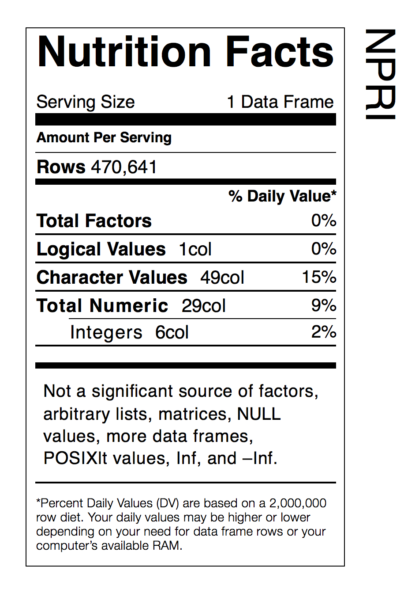

National Pollutant Release Inventory (NPRI) for Canada, 1993–2012. A dataset with 470,641 rows and 79 columns.

## Installation

This data-only package can be installed from GitHub with the `devtools` package:

```coffee
require(devtools)
install_github('rich-iannone/NPRI')
```
